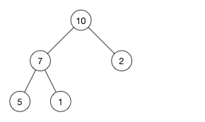

在海量数据中找出出现频率最好的前k个数，或者从海量数据中找出最大的前k个数，这类问题通常被称为top K问题。

针对top K问题，通常常用的方式是分治+ Trie树/hash +小顶堆（最小堆）

- 分治：将数据先分成n份，找出需要的一部分数据，再合并再一起寻找最终结果
- Trie树/hash：是词频类top k问题统计词频的，本题用不到
- 小顶堆（最小堆）：O（1）的时间找到最小，并且替换最小后用O（logn）完成调整

## 解法

本题可用分治+小顶堆（最小堆）处理，分成n份，每份是m条数据

- 每份构建K个最小堆的时间复杂度为O（mlogK）
- n个最小堆进行比较选出最大数与第K个数的时间复杂度为O（nlogK）
- 总时间复杂度为O（mlogK+nlogK）分的份数一般不会太大，是常数，可以简化为O（mlogK）

## 最大堆最小堆

上面是最大堆，最小堆即最小的在上面

- 最大堆：父节点的值比每一个子节点的值都要大，是完全二叉树
- 最小堆：父节点的值比每一个子节点的值都要小，是完全二叉树
- 插入：根据完全二叉树性质，直接插入到最下面一层，然后与父节点比较，根据大小判断是否与父节点交换，依次递归到适合的位置，时间复杂度O（logn）
- 删除：删除根节点，此时根节点空缺，将最下层最右边的节点移动到根节点，然后移上去的节点与左子节点比较，根据大小判断是否与左子节点交换，依次递归到适合的位置，时间复杂度O（logn）