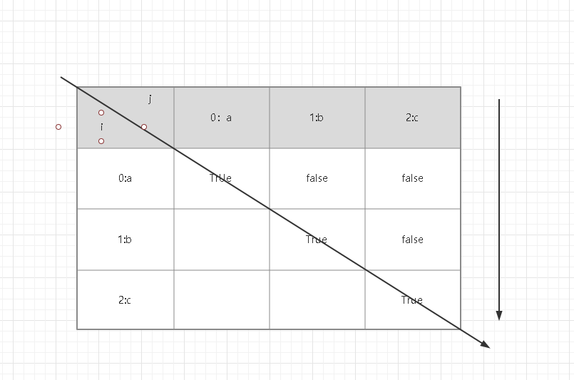

## 思路

如果一个字符串是回文串，那它的开头和末尾肯定相等，，并且减去开头和末尾，它依然是一个回文串。
可以定义dp(i,j)是从i到j的字符串是否为回文串，dp（i,j）=dp(i+1,j-1)。
考虑边界值，当为一个字符串的时候，肯定为回文，当长度小于等于3的时候，只需要判断首位是否相等。填表时从短的填起走。

## 时间复杂度
两次循环
O（n^2）

## 空间复杂度
额外维护二维数组
O(n^2)

