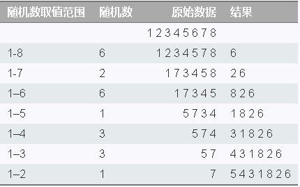

## 思路

洗牌算法，先用一个100长度的数组存储1到100的数字，然后依次用产生随机数，并把对应位置的数移出到结果集中。

## 时间复杂度

O（n）

## 空间复杂度
只有10个数字时，为O（1）
产生输入多少个，输出多少个不重复随机数时O（n）

## 参考

[Fisher–Yates shuffle 洗牌算法](https://gaohaoyang.github.io/2016/10/16/shuffle-algorithm/)

