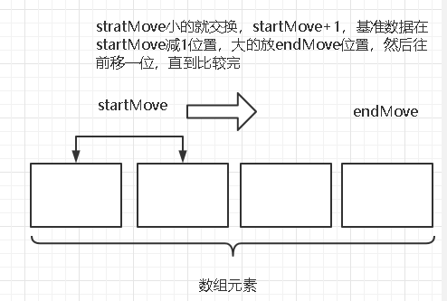

## 思路

通过第一个元素作为基准，把要比较的数组分为比基准小的部分，与比基准大的部分。

然后依次比较元素，大的往后面放，小的往前面放，如下图

## 时间复杂度
每次分为两部分，相当于成为一颗树，每层比较n次，然后乘以树高度。
理想情况下，每次均分，树的高度是logn，时间复杂度为O(nlogn)。
最坏情况下，基准每次都是最大或最小的，树的高度为n，时间复杂度为O(n^2)。

平均为O（nlogn）。

## 空间复杂度

每次创建递归数组额外创建3个变量，最坏O（3n）->O（n），最好O（3logn）->O（logn），平均为O（logn）。