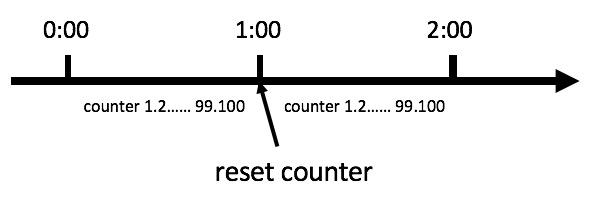
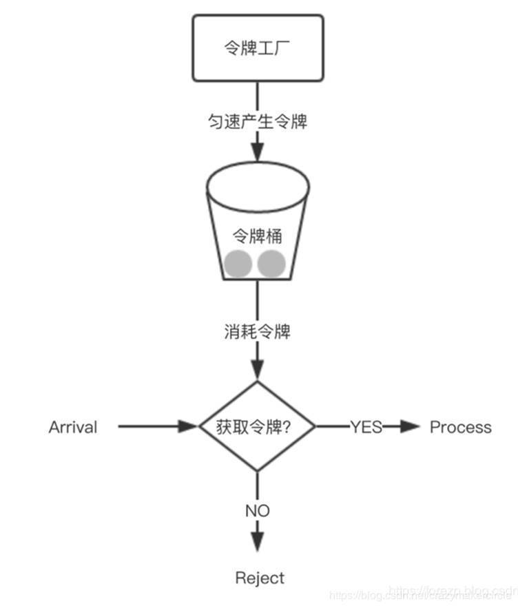

## 计数器算法

设置一段时间内访问总数不能超过多少，超过就拒绝访问，过了这段时间就重置访问数量，重新计数。

### 滑动窗口计数

计数器算法存在临界值问题，在第一段时间的最后一秒访问数很大，在第二段时间的第一秒访问数也很大，因为时间切换重置计数了，并未拒绝请求，但这样是不合理的。

为了尽量避免临界值问题，可以使用滑动窗口计数。将统计时间等分，依次滑动，统计窗格里面的成功失败数目。

## 漏桶算法

将请求都存储在漏桶中，以恒定速度向外转发请求，当漏桶满了的时候，拒绝新的请求
## 令牌桶算法

以固定速率生存令牌，放入桶中，当桶满了，不再放入。取到令牌才能访问，没取到令牌拒绝访问。令牌桶能较为均匀的分布请求，又能接受服务器承受范围的突发请求

